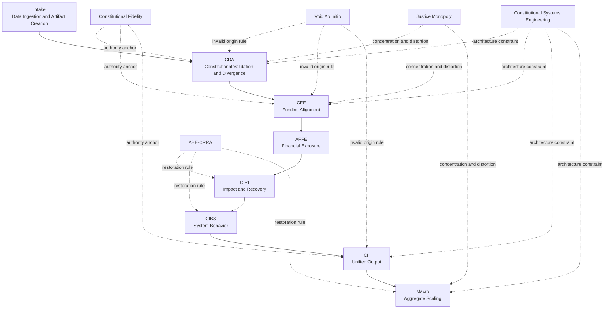

# System Map — A.B.E. Architecture

## Function

The System Map defines the structure, flow, and relationships of the A.B.E. engine.

It represents the full calculation chain from input to macro-scale output.

---

## System Flow

Input  
→ Intake  
→ CDA  
→ CFF  
→ AFFE  
→ CIRI  
→ CIBS  
→ CII  
→ Macro

---

## System Flow (Visual)

---

## Module Relationships

Each module receives output from the previous module and extends the calculation.

No module operates independently.

Outputs are cumulative and propagate through the system.

---

## Execution Order

1. Intake — Data ingestion and artifact creation  
2. CDA — Evaluate constitutional alignment  
3. CFF — Validate funding against authority  
4. AFFE — Quantify financial exposure  
5. CIRI — Model impact and recovery  
6. CIBS — Evaluate system-wide effects  
7. CII — Integrate all outputs  
8. Macro — Aggregate total system impact  

---

## Deterministic Structure

The system operates sequentially.

- No branching logic
- No conditional execution paths
- No interpretation layer

Each step produces output that directly feeds the next.

---

## Data Flow

- Input data enters through Intake
- Each module processes and appends results
- Outputs are preserved at every stage
- Final output reflects total system condition

---

## System Dependency

The integrity of the system depends on full execution of all modules.

- Skipping modules breaks output accuracy
- Altering sequence breaks system logic
- Removing modules removes measurable components

---

## Doctrine Relationship

Doctrine defines system constraints.

The engine applies those constraints through calculation.

### Constitutional Fidelity
Defines the authority baseline.

### Void Ab Initio
Defines invalid origin conditions.

### ABE-CRRA
Defines restoration through lawful realignment.

### Justice Monopoly
Defines concentrated distortion and enforcement imbalance.

### Constitutional Systems Engineering
Defines system architecture, boundaries, and visibility of overstep.

---

## Divergence Propagation

Divergence identified in CDA propagates through all modules:

- CFF → funding misalignment
- AFFE → financial cost
- CIRI → social and economic impact
- CIBS → system-wide effects
- Macro → aggregate economic drag

---

## Recovery Propagation

Removal of divergence propagates recovery:

- CIRI → restored participation
- CIBS → compounding benefits
- Macro → total economic uplift

---

## Core Principle

The system is unified.

All modules operate under the same authority model and contribute to a single result.

No domain, function, or module exists in isolation.

---

## Result

The System Map provides a complete representation of:

- system structure
- module relationships
- doctrine linkage
- data flow
- calculation sequence

It ensures that A.B.E. operates as a unified, deterministic system.
